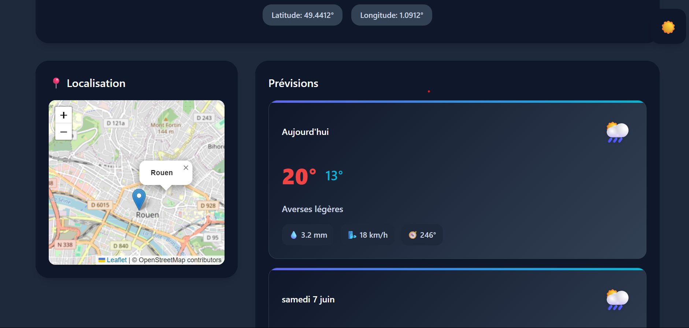

#  Instant Weather V2

> Projet individuel JavaScript réalisé par **Maxence Canival**

---

##  Objectif du projet

Ce projet vise à créer une application web responsive permettant à l'utilisateur :

- de consulter les prévisions météo de la commune de son choix,
- de personnaliser les données affichées (pluie, vent, coordonnées...),
- de bénéficier d'une interface moderne et accessible (WCAG AA 2.0),
- d’exploiter une API météo conformément à sa documentation.

Ce projet respecte les exigences de la **SAÉ 2.03**.

---

##  Démo en ligne

[](https://mcmt27.github.io/SAE23/)

> Cliquez sur l'image pour accéder à la démonstration hébergée sur GitHub Pages.

---

##  Fonctionnalités principales

-  Saisie de code postal + sélection de la commune
-  Choix dynamique du nombre de jours de prévision (1 à 7)
-  Carte interactive (Leaflet) avec position de la commune
-  Affichage des options météo :
  - coordonnées GPS (latitude/longitude)
  - cumul de pluie
  - vitesse et direction du vent
-  Dark mode (mode sombre)
-  Historique des recherches (stocké en localStorage avec suppression possible)

---

## Technologies utilisées

- **HTML5** / **CSS3** / **JavaScript**
- [API Open-Meteo](https://open-meteo.com/)
- [API geo.api.gouv.fr](https://geo.api.gouv.fr/)
- [Leaflet.js](https://leafletjs.com/) pour la carte
- Git & GitHub pour le versionnage

---

## Organisation du projet

```
instant-weather/
├── index.html          # Page principale
├── styles.css          # Style global (mode clair / sombre)
├── script.js           # Logique JavaScript : API, DOM, carte, historique
└── README.md           # Ce fichier
```